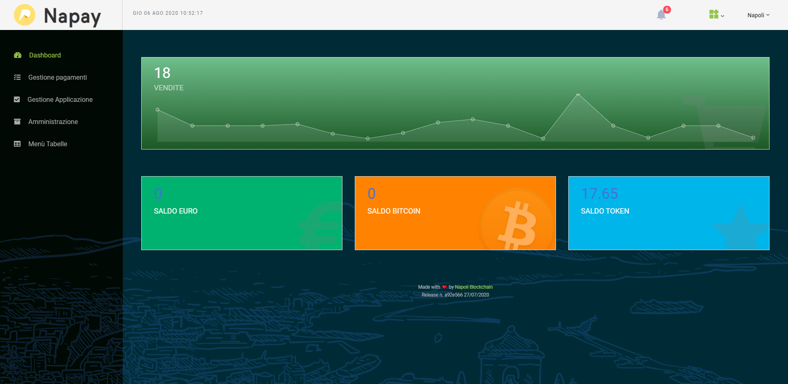

# fidelity Dashboard

This is a fork of napoliblockchain/napay software
[](https://napay.napoliblockchain.it)


Fidelity è un'applicazione web nata per gestire facilmente i pagamenti in token ERC20


Napay è stata sviluppata in **quattro** distinte applicazioni:
```
- Napay             -> Il nucleo dell'applicazioni
- Bolt              -> Il Wallet del cittadino per i Token TTS
```
Il nucleo dell'applicazione è stato ideato per lavorare al meglio su un desktop. Tuttavia, basta anche solo uno smartphone per iniziare a guadagnare bitcoin.

[](https://napay.napoliblockchain.it)


### Authors

Made with ❤️ by [Sergio Casizzone](https://sergiocasizzone.it)


### Features

**Dashboard**

- [x] Desktop & Mobile Layout
- [x] Bitcoin Transactions list & details
- [x] Token (TTS) Transactions list & details
- [x] Exchange amount account & Transactions list
- [x] Manage Multiple Stores
- [x] Manage Multiple POS for single store
- [x] Manage a shop cart for desktop POS with customizable product list
- [x] POS Point of sale app for desktop & mobile
- [x] Wallet for Naples Payment Token (TTS)
- [x] PayPal payments for new subscriptions


**Dashboard for administrators**

- [x] Manage Association Members
- [x] Manage Members' payments
- [x] Manage registration requests
- [x] Manage Assembly Association records
- [x] Manage GDPR, Btcpay Server, Vapid keys for push messages
- [x] Manage all application tables

**PWA**

- [x] Service Worker
- [x] Push messages

[](https://opensource.org/licenses/MIT)


## how to install webapp
**prerequisites**

```
apt-get install php7.2-imap
apt-get install php7.2-bcmath // Per far funzionare correttamente il pairing
apt-get install php-gmp // Per far funzionare correttamente il pairing
apt install php-imagick php-gd
apt install tmux
```
_DON'T FORGET TO RELOAD APACHE_
```
sudo systemctl restart apache2
```


### Install yii framework

```
cd /var/www
wget https://github.com/yiisoft/yii/releases/download/1.1.22/yii-1.1.22.bf1d26.tar.gz
tar -zxvf yii-1.1.22.bf1d26.tar.gz
mv yii-1.1.20.bf1d26 yii-1.1.22
```

### Install Napay

```
cd /var/www
git clone https://github.com/napoliblockchain/napay.git
cd napay
./update.sh
```

### Install package libraries
This repository contains all packages used by Napay applications.
```
cd /var/www
git clone https://github.com/jambtc/packages.git
```

### Install Wallet-tts
```
cd /var/www
git clone https://github.com/napoliblockchain/wallet-tts.git
cd wallet-tts
./update.sh
```

### Install POS
```
cd /var/www
git clone https://github.com/napoliblockchain/pos.git
cd pos
./update.sh
```

### Install BOLT
```
cd /var/www
git clone https://github.com/napoliblockchain/bolt.git
cd bolt
./update.sh
```

### Install a new and fresh mysql database
```
mysql -u root -p (password)
create database npay;
use npay;
source npay-vuoto.sql;
```


#### how to install docker electrum wallet daemon
Docker Electrum Wallet v. 3.3.3
```
git clone https://github.com/osminogin/docker-electrum-daemon.git
cd docker-electrum-daemon
```
Modificare Dockerfile con questo contenuto
`ENV ELECTRUM_VERSION 3.3.3`
```
nano Dockerfile
```
quindi eseguire
```
docker-compose build
docker tag 638a2b976ddc napay/electrum:latest
docker rmi docker-electrum-daemon_electrum
```


#### how to install geth (for POA testing)
```
sudo apt-get install software-properties-common
sudo add-apt-repository -y ppa:ethereum/ethereum
sudo apt-get update
sudo apt-get install ethereum
```
